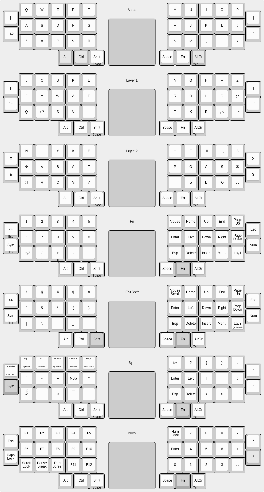
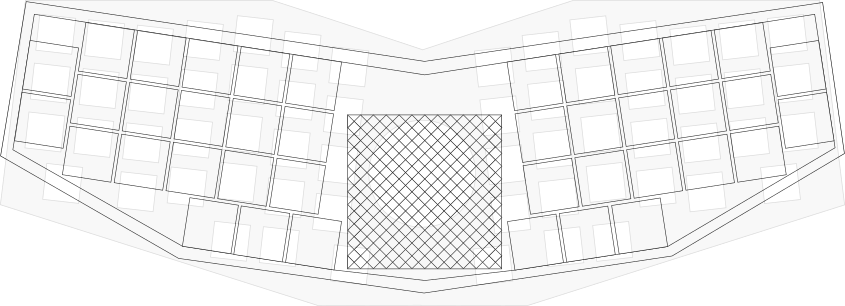

# Keyboard CatBoard-40

Firmware: [Arduino](Arduino/)

---

# Клавиатура КошкоКлава-40

Сравнение с [КошкоКлавой-2](http://catboard.klava.org/ru.html).

Размеры клавиатуры аналогичные с прежней, новая немного ниже, однако при этом имеет тачпад, имеющий тесную интеграцию с клавиатурой, при управлении мышью клавиатура автоматически будет переводиться в режим мыши. Для тачпада используется один или два контроллера MPR-121, 6x6 или 12x12 линий.

В прежней КошкоКлаве было 60 кнопок, в новой их на треть меньше, всего 40. На фингерах 34 кнопки, как раз хватает для всех букв русского алфавита и точки.

Возможно создание нестандартной своей раскладки, при этом она будет аппаратной. Как пример, указан вариант с фонетической JCUKEN раскладкой, при этом сочетания с модификаторами Ctrl, Alt, Win работают в QWERTY раскладке.

Прошивка: [Arduino](Arduino/)
